# 🏥 Enterprise Healthcare Management Platform

<div align="center">


**🚀 A comprehensive healthcare management solution featuring Flutter mobile app, PHP web portal, and secure RESTful API backend**

[📱 Live Demo](#-screenshots) • [🌐 Web Portal](#-screenshots) • [📖 Documentation](#-api-documentation) • [🔗 LinkedIn Post](https://www.linkedin.com/posts/gishor-thavakumar_project-6-smart-hospital-record-system-activity-7062773442588114944-_6YA?utm_source=share&utm_medium=member_desktop&rcm=ACoAAC09bw4B-aTQ2w2igcCACju_eXeeWPPdJEM)

</div>

---

## 📋 Table of Contents

- [🎯 Overview](#-overview)
- [✨ Key Features](#-key-features)
- [🛠️ Technology Stack](#️-technology-stack)
- [🏗️ System Architecture](#️-system-architecture)
- [📱 Mobile Application](#-mobile-application)
- [🌐 Web Administration Portal](#-web-administration-portal)
- [📸 Screenshots](#-screenshots)
- [🚀 Getting Started](#-getting-started)
- [📖 API Documentation](#-api-documentation)
- [🔐 Security Features](#-security-features)
- [📊 Database Schema](#-database-schema)
- [🤝 Contributing](#-contributing)
- [📄 License](#-license)

---

## 🎯 Overview

The **Enterprise Healthcare Management Platform** is a comprehensive, full-stack solution designed to revolutionize healthcare administration and patient experience. This platform bridges the gap between patients and healthcare providers through a sophisticated mobile application and a powerful web-based administration system.

### 🌟 Why This Platform?

- **🏥 Complete Healthcare Ecosystem**: Seamlessly connects patients, doctors, and administrative staff
- **📱 Patient-Centric Mobile Experience**: Intuitive Flutter app for iOS and Android
- **💼 Enterprise-Grade Web Portal**: Comprehensive hospital management system
- **🔗 Unified API Backend**: Secure, scalable RESTful services
- **🔐 Advanced Security**: Multi-factor authentication with OTP integration
- **📊 Real-Time Analytics**: Data-driven insights for healthcare management

---

## ✨ Key Features

<div align="center">

| 📱 **Mobile App Features** | 🌐 **Web Portal Features** | 🔗 **API Features** |
|:---------------------------|:----------------------------|:---------------------|
| ✅ Multi-factor Authentication | ✅ Doctor Management System | ✅ RESTful API Architecture |
| ✅ Complete Medical History | ✅ Patient Registration & Profiles | ✅ Secure Data Encryption |
| ✅ Appointment Scheduling | ✅ Appointment Scheduling | ✅ OTP-based Authentication |
| ✅ Prescription Management | ✅ Medical Records Management | ✅ Real-time Data Sync |
| ✅ Real-time Notifications | ✅ Staff Management | ✅ Comprehensive Error Handling |
| ✅ Doctor Communication | ✅ Financial Reports & Analytics | ✅ SMS Integration |
| ✅ Profile Management | ✅ Medicine Database | ✅ Session Management |
| ✅ Offline Capability | ✅ Multi-role Access Control | ✅ Data Validation |

</div>

---

## 🛠️ Technology Stack

<div align="center">

### 📱 **Mobile Development**


### 🌐 **Web Development**


### 🗄️ **Backend & Database**


### 🔧 **Tools & DevOps**


</div>

---

## 🏗️ System Architecture

<div align="center">

</div>

> **Architecture Overview**: The platform consists of three main components - Flutter mobile app, PHP web portal, and RESTful API backend, all connected to a centralized MySQL database with SMS gateway integration for OTP services.

---

## 📱 Mobile Application

### 🎯 **Patient-Focused Experience**

The Flutter mobile application provides patients with comprehensive access to their healthcare information and services.

#### 🌟 **Core Features:**

- **🔐 Secure Authentication**
  - Username/Password login
  - OTP-based mobile verification
  - Biometric authentication support
  - Session management

- **📋 Medical Records Management**
  - Complete medical history
  - Doctor visit summaries
  - Diagnostic reports
  - Treatment plans

- **📅 Appointment System**
  - Book new appointments
  - View upcoming appointments
  - Appointment history
  - Real-time status updates

- **💊 Prescription Tracking**
  - Current medications
  - Prescription history
  - Medicine details and dosage
  - Refill reminders

#### 📱 **Mobile Technology Highlights:**

- **Cross-Platform Compatibility**: Single codebase for iOS and Android
- **Responsive Design**: Adaptive UI for all screen sizes
- **Offline Capability**: Core features work without internet
- **Push Notifications**: Real-time updates and reminders
- **Secure Data Storage**: Encrypted local data storage

---

## 🌐 Web Administration Portal

### 🏥 **Hospital Management System**

The comprehensive web portal empowers healthcare administrators, doctors, and staff with powerful management tools.

#### 🎯 **Administrative Modules:**

- **👨‍⚕️ Doctor Management**
  - Doctor profiles and credentials
  - Schedule management
  - Performance analytics
  - Communication tools

- **🏥 Patient Management**
  - Patient registration and profiles
  - Medical history tracking
  - Guardian/emergency contacts
  - Patient search and filtering

- **📅 Appointment Management**
  - Appointment scheduling
  - Calendar integration
  - Status tracking
  - Conflict resolution

- **💊 Prescription & Medicine**
  - Medicine database
  - Prescription creation
  - Drug interaction checking
  - Inventory management

- **📊 Analytics & Reporting**
  - Financial reports
  - Patient statistics
  - Performance metrics
  - Custom report generation

#### 🌐 **Web Technology Highlights:**

- **Responsive Design**: Bootstrap-powered adaptive interface
- **Role-Based Access**: Multi-level user permissions
- **Real-Time Dashboard**: Live data updates and notifications
- **Advanced Search**: Powerful filtering and search capabilities
- **Export Functionality**: PDF and Excel report generation

---

## 📸 Screenshots

### 📱 **Mobile Application Screenshots**

<div align="center">

| Onboarding | Login | Dashboard | Medical Records |
|:----------:|:-----:|:---------:|:---------------:|
| 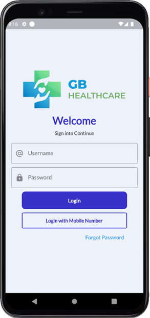 | 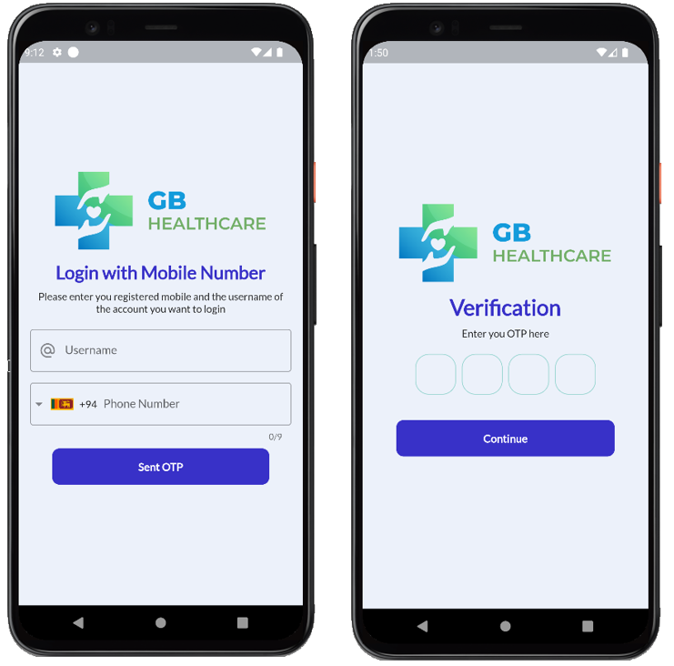 | 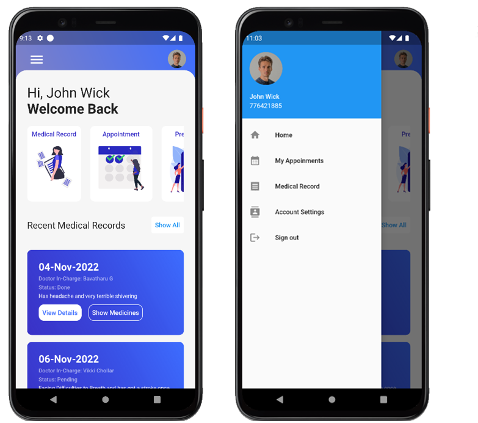 | 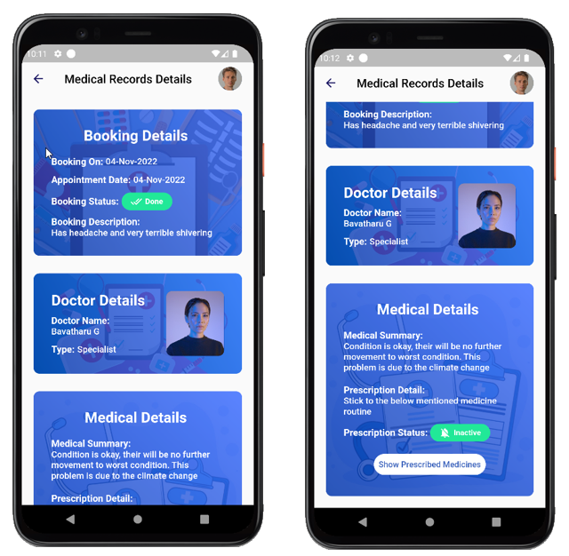 |

| Appointments | Prescriptions | Profile | Notifications |
|:------------:|:-------------:|:-------:|:-------------:|
| 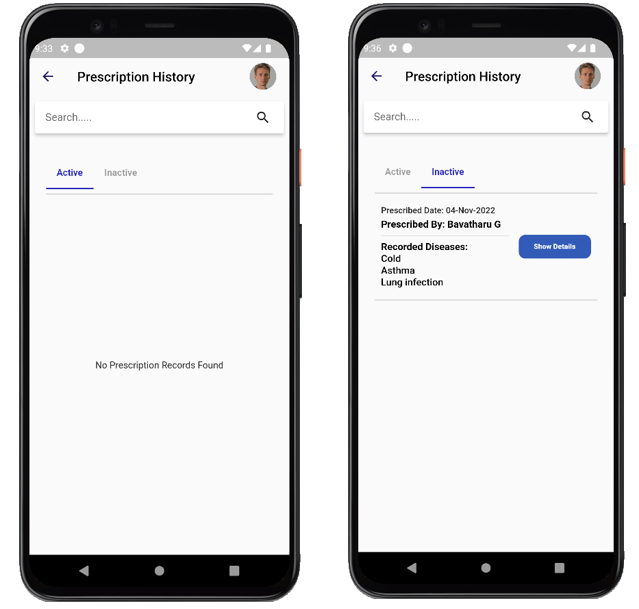 | 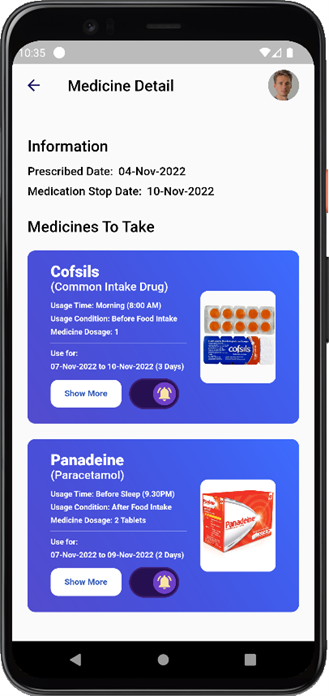 | 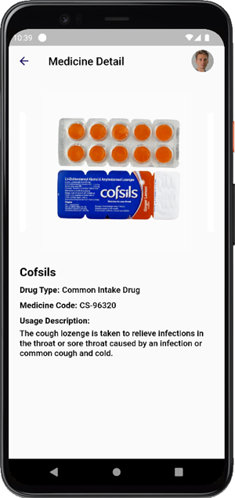 | 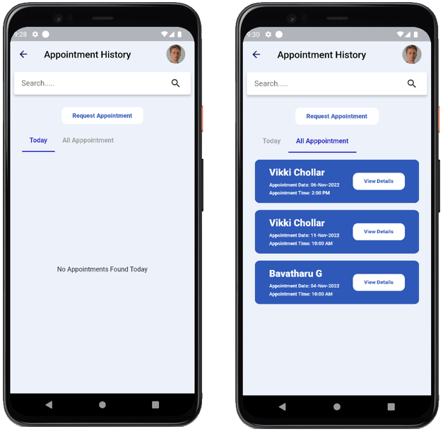 |

</div>

### 🌐 **Web Portal Screenshots**

<div align="center">

| Dashboard | Patient Management | Doctor Management | Appointments |
|:---------:|:------------------:|:-----------------:|:------------:|
|  |  |  | 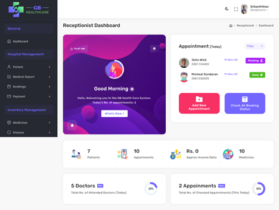 |

| Medical Records | Analytics | Reports | Settings |
|:---------------:|:---------:|:-------:|:--------:|
| 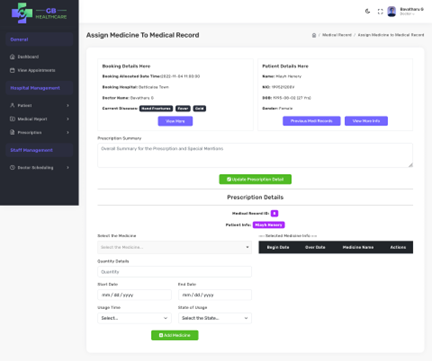 |  |  |  |

</div>

---

## 🚀 Getting Started

### 📋 **Prerequisites**

- **Flutter SDK** (3.0 or higher)
- **PHP** (8.0 or higher)
- **MySQL** (8.0 or higher)
- **Composer** (PHP dependency manager)
- **Node.js** (for web build tools)

### 🔧 **Installation Steps**

#### 1️⃣ **Clone the Repository**
```bash
git clone https://github.com/yourusername/Enterprise-Healthcare-Management-Platform-Flutter-PHP-Backend.git
cd Enterprise-Healthcare-Management-Platform-Flutter-PHP-Backend
```

#### 2️⃣ **Database Setup**
```bash
# Create MySQL database
mysql -u root -p
CREATE DATABASE smart_hrms;

# Import database schema
mysql -u root -p smart_hrms < database/schema.sql

# Import sample data (optional)
mysql -u root -p smart_hrms < database/sample_data.sql
```

#### 3️⃣ **Backend API Setup**
```bash
# Navigate to API directory
cd mobile-app-scripts/

# Configure database connection
cp config/database.example.php config/database.php
# Edit database.php with your MySQL credentials

# Set up web server (Apache/Nginx)
# Ensure PHP extensions: mysqli, openssl, curl
```

#### 4️⃣ **Web Portal Setup**
```bash
# Navigate to admin web directory
cd admin-web/

# Install PHP dependencies
composer install

# Install Node.js dependencies
npm install

# Build assets
gulp build

# Configure web server document root to admin-web/
```

#### 5️⃣ **Mobile App Setup**
```bash
# Navigate to Flutter app directory
cd lib/

# Install Flutter dependencies
flutter pub get

# Configure API endpoints
# Edit lib/constants.dart with your server URL

# Run the app
flutter run
```

### 🌐 **Environment Configuration**

#### **API Configuration** (`mobile-app-scripts/config/database.php`)
```php
<?php
$config = [
    'host' => 'localhost',
    'username' => 'your_username',
    'password' => 'your_password',
    'database' => 'smart_hrms',
    'encryption_key' => 'your_encryption_key'
];
?>
```

#### **Flutter Configuration** (`lib/constants.dart`)
```dart
// API Base URL
const String API_BASE_URL = 'http://your-server.com/mobile-app-scripts/';

// App Configuration
const String APP_NAME = 'GB Healthcare';
const String APP_VERSION = '1.0.0';
```

---

## 📖 API Documentation

### 🔗 **Base URL**
```
http://your-server.com/mobile-app-scripts/
```

### 🔐 **Authentication Endpoints**

| Method | Endpoint | Description | Parameters |
|:-------|:---------|:------------|:-----------|
| `POST` | `/login-check.php` | Standard login | `username`, `password` |
| `POST` | `/sent-otp-login.php` | Send OTP | `username`, `mobilenumber` |
| `POST` | `/login-with-otp.php` | Verify OTP | `username`, `otp` |

### 👤 **Patient Endpoints**

| Method | Endpoint | Description | Parameters |
|:-------|:---------|:------------|:-----------|
| `GET` | `/get-patient-info.php` | Get patient details | `id` |
| `GET` | `/get-booking.php` | Get appointments | `id` |
| `GET` | `/get-appointment-history.php` | Appointment history | `id` |

### 🏥 **Medical Endpoints**

| Method | Endpoint | Description | Parameters |
|:-------|:---------|:------------|:-----------|
| `GET` | `/get-mediRecord.php` | Medical records | `id` |
| `GET` | `/get-mediRecDetail.php` | Record details | `id` |
| `GET` | `/get-prescriptionHistory.php` | Prescriptions | `id`, `preStatus` |

### 📝 **Request/Response Examples**

#### **Login Request**
```json
POST /login-check.php
{
    "username": "patient123",
    "password": "securepassword"
}
```

#### **Login Response**
```json
{
    "status": true,
    "message": "Success",
    "patient": "12345"
}
```

---

## 🔐 Security Features

### 🛡️ **Data Protection**

- **🔐 AES-128-CTR Encryption**: All passwords encrypted using OpenSSL
- **🔑 Session Management**: Secure session handling with SharedPreferences
- **📱 OTP Authentication**: SMS-based two-factor authentication
- **🚫 SQL Injection Prevention**: Parameterized queries and input validation
- **🔒 HTTPS Enforcement**: All API communications over HTTPS
- **📊 Error Handling**: Comprehensive exception management

### 🔍 **Authentication Flow**

<div align="center">

</div>

> **Security Process**: The system supports both traditional username/password authentication and secure OTP-based login via SMS, ensuring multi-factor authentication for enhanced security.

---

## 📊 Database Schema

### 🗄️ **Core Tables**

<div align="center">

| Table | Purpose | Key Relationships |
|:------|:--------|:------------------|
| `patient` | Patient information & auth | Primary table for user data |
| `doctor` | Doctor profiles | Links to appointments & records |
| `booking` | Appointment scheduling | Links patients, doctors, status |
| `medicalrecord` | Patient medical history | Links to bookings & patients |
| `prescription` | Medication prescriptions | Links to medical records |
| `medicine` | Drug database | Referenced by prescriptions |
| `staff` | Hospital staff management | Administrative users |
| `bookingstatus` | Appointment status tracking | Referenced by bookings |

</div>

### 🔗 **Entity Relationship Overview**

<div align="center">
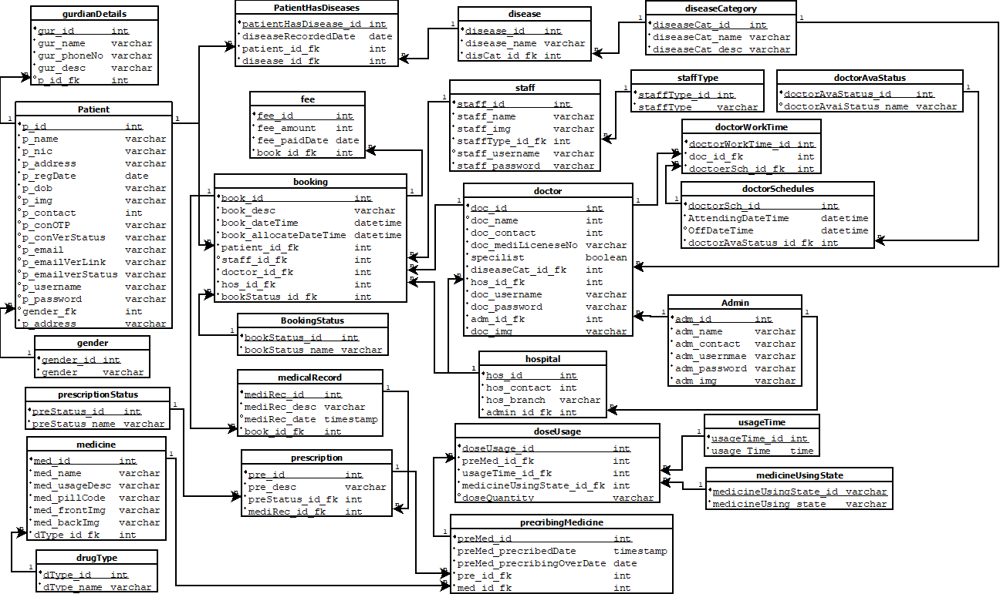
</div>

> **Data Model**: The database design ensures referential integrity and supports complex healthcare workflows from patient registration through medical records and prescription management.

---

## 🎯 **Performance & Scalability**

### 📈 **Optimization Features**

- **⚡ Lazy Loading**: Efficient data loading in mobile app
- **💾 Caching Strategy**: Local data caching for offline access
- **🔄 Connection Pooling**: Optimized database connections
- **📊 Query Optimization**: Indexed database queries
- **🎨 Image Optimization**: Compressed image delivery
- **📱 Progressive Loading**: Incremental content loading

### 🌐 **Deployment Architecture**

<div align="center">

</div>

> **Scalable Infrastructure**: Production-ready architecture with load balancing, database replication, and external service integration designed for high availability and performance.

---

## 🤝 Contributing

We welcome contributions from the community! Here's how you can help:

### 🛠️ **Development Setup**

1. **Fork** the repository
2. **Create** a feature branch: `git checkout -b feature/amazing-feature`
3. **Commit** your changes: `git commit -m 'Add amazing feature'`
4. **Push** to the branch: `git push origin feature/amazing-feature`
5. **Open** a Pull Request

### 📝 **Contribution Guidelines**

- Follow the existing code style and conventions
- Write clear, commented code
- Include tests for new features
- Update documentation as needed
- Ensure all tests pass before submitting

### 🐛 **Reporting Issues**

Found a bug? Please create an issue with:
- Clear description of the problem
- Steps to reproduce
- Expected vs actual behavior
- Screenshots (if applicable)
- Environment details

---

## 📞 Contact & Support

<div align="center">

### 👨‍💻 **Developer**

**[Your Name]**

[](YOUR_LINKEDIN_PROFILE)
[](YOUR_GITHUB_PROFILE)
[](mailto:your.email@example.com)

### 🔗 **Project Links**

[📖 Documentation](./docs) • [🐛 Issues](./issues) • [💬 Discussions](./discussions) • [📝 LinkedIn Post](YOUR_LINKEDIN_POST_LINK)

</div>

---

## 📄 License

This project is licensed under the **MIT License** - see the [LICENSE](LICENSE) file for details.

---

<div align="center">

### 🌟 **If you found this project helpful, please give it a star!** ⭐

**Built with ❤️ using Flutter, PHP, and MySQL**


</div>

---

## 🏆 **Project Achievements**

- ✅ **Full-Stack Development**: Complete mobile and web solution
- ✅ **Enterprise-Grade Security**: Multi-factor authentication and encryption
- ✅ **Scalable Architecture**: Designed for high-volume healthcare operations
- ✅ **Cross-Platform Compatibility**: iOS, Android, and web support
- ✅ **Healthcare Compliance**: Built with healthcare industry standards in mind
- ✅ **Real-Time Features**: Live notifications and data synchronization
- ✅ **Production-Ready**: Comprehensive error handling and logging

---
